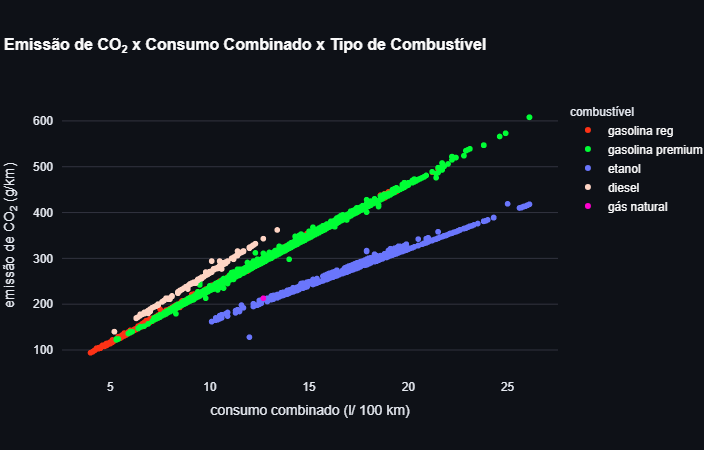
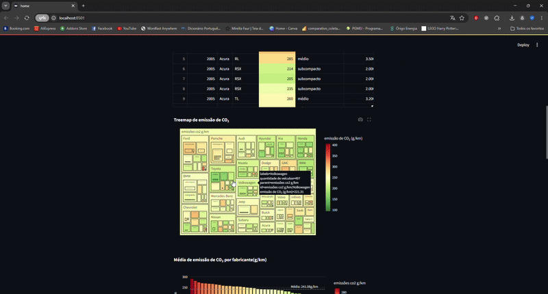
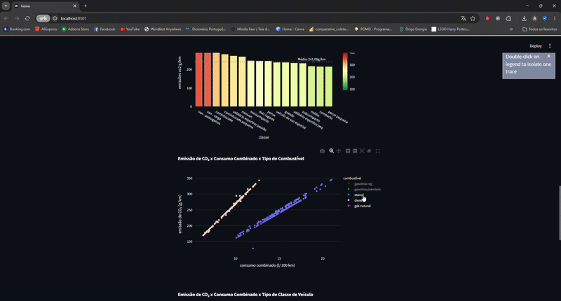

# 📌 Análise emissão de CO2 por veículos 

Imagem de rawpixel.com no Freepik: https://br.freepik.com/fotos-gratis/trafego-lotado-e-movimentado-na-estrada_16497169.htm/

PT

📊 Análise de Emissões de CO2 em Veículos

PT 🇧🇷
Visão Geral do Projeto
Este projeto tem como objetivo prever e analisar as emissões de CO2 em veículos automotores com base em características técnicas, de desempenho e categorização dos veículos. Foram utilizadas técnicas de machine learning para identificar os principais fatores que influenciam as emissões e desenvolver modelos preditivos precisos.

🔍 Contexto
Base retirada do site do [governo
canadense](https://open.canada.ca/data/en/dataset/98f1a129-f628-4ce4-b24d-6f16bf24dd64).

Os conjuntos de dados fornecem classificações de consumo de combustível específicas do
modelo e emissões estimadas de dióxido de carbono para novos veículos leves para venda
no varejo no Canadá entre os anos de 2005 e 2024.


📊 Análise Exploratória

#### Base: 

A relação entre número de cilindros, tamanho do motor e especialmente consumo de combustível em l por km foi constatada nas análises gráficas, assim como indicação de uma relação inversamente proporcional entre emissão de CO2 e ano do modelo. 
Pode estar relacionado com melhores tecnologias. Precisa ser melhor avaliado para entender a razão.

No Canadá, o uso do etanol parece estar associado a veículos de maior porte.

Também é possível constatar uma queda na quantidade de veículos, no Canadá. 


Para preparar a base para o modelo de machine learning optei por:

    * remoção de vazamento de dados (colunas que contêm informação do target)
    
    * agrupamento de categorias esparsas
    
    * criação de features mais robustas
    

#### Distribuições: 

É possível perceber que a distribuição das features numéricas estão bem próximas do normal, embora umpouco assimétricas (com exceção do model_year)


⚙️ Machine Learning

##### ESTRATÉGIA DE PRÉ-PROCESSAMENTO:

1. Variáveis categóricas não ordenadas: One-Hot Encoding
   (para classes sem relação ordinal)
2. Variáveis categóricas ordenadas: Ordinal Encoding
   (para classes com relação ordinal explícita)
3. Variáveis numéricas:
   - Normalização Min-Max para 'model_year' (distribuição quase normal)
   - Power Transform para outras numéricas (assimetria presente)

##### DIFERENCIAÇÃO DE PRÉ-PROCESSAMENTO:

1. Para modelos lineares/SVM/KNN: Normalização mais robusta
   - OneHotEncoding para categóricas
   - PowerTransformer para numéricas assimétricas
2. Para modelos baseados em árvores: Menos pré-processamento necessário
   - Apenas codificação ordinal/one-hot
   - Não requer normalização de features numéricas

###### ESTRATÉGIA DE MODELAGEM:
Testar diversos tipos de algoritmos:
    - Lineares (simples, interpretáveis)
    - Baseados em árvores (potentes para relações não-lineares)
    - SVM (para comparação)
    - Usar validação cruzada para avaliação robusta
    - Avaliar o melhor modelo para tunagem de hiperparâmetros


##### OBSERVAÇÕES INICIAIS:

1. Modelos lineares (Ridge, LinearRegression) apresentam excelente desempenho (R² ~1.0)
2. Lasso teve desempenho ruim 
3. Modelos baseados em árvores têm desempenho similar entre si (R² ~0.82)
4. KNN também apresentou excelente desempenho


###### --- OTIMIZAÇÃO DO MODELO RIDGE ---


JUSTIFICATIVA PARA ESCOLHA DO RIDGE:

1. Excelente desempenho (melhor RMSE entre os lineares)
2. Permite interpretação dos coeficientes
3. Mais estável que LinearRegression puro
4. Menor tempo de execução que SVM/KNN



📉 Resultados
Melhor modelo: Ridge Regression (α=0.75)

RMSE: 3.72 g CO2/km

R²: 0.999

Interpretabilidade: Excelente (coeficientes lineares)

Comparativo de Modelos

🔎 Insights Principais
Fatores que AUMENTAM emissões:

Consumo urbano (+0.76 coeficiente)

Consumo rodoviário (+0.43)

Tamanho do motor (categorias superiores)

Fatores que REDUZEM emissões:

Uso de etanol (-2.15 vs gasolina)

Gasolina premium (-0.62 vs regular)

Veículos especiais (-0.03)

📌 Conclusão
Modelos lineares apresentaram desempenho excepcional, sugerindo forte relação linear entre features e target

O Ridge Regression mostrou o melhor equilíbrio entre desempenho e interpretabilidade

Variáveis de consumo (urbano/rodoviário) são os principais drivers das emissões

Combustíveis alternativos (como etanol) mostraram impacto positivo na redução de emissões

##### Insights:

   - Pesquisar se a razão da redução de veículos está associada ao investimento de transporte público, carros elétricos ou a um cenário econômico. Avaliar se é uma tendência e seu impacto na redução de emissão CO2. 


EN 🇺🇸
📊 Vehicle CO2 Emissions Analysis
Project Overview
This project aims to predict and analyze CO2 emissions from motor vehicles based on technical specifications, performance metrics, and vehicle categorization. We employed Machine Learning techniques to identify key emission factors and develop accurate predictive models.

Key Findings
Top Emission Drivers:

Urban fuel consumption (strongest positive correlation)

Highway fuel consumption

Engine size categories

Emission Reduction Factors:

Ethanol fuel usage (-2.15 coefficient vs gasoline)

Premium gasoline (-0.62 vs regular)

Special purpose vehicles

Best Performing Model:

Ridge Regression (α=0.75)

RMSE: 3.72 g CO2/km

R²: 0.999

['Clique aqui para explorar os dados e fazer uma estimativa '](https://emissaoco2-fbps.streamlit.app/)



## Organização do projeto

```

├── dados              <- Arquivos de dados para o projeto.
├── modelos            <- Modelos gerados para o projeto.
|
├── notebooks          <- Cadernos Jupyter. 
│
|   └──src             <- Código-fonte para uso neste projeto.
|      │
|      ├── __init__.py  <- Torna um módulo Python
|      ├── auxiliares.py<- Funções auxiliares do projeto
|      ├── config.py    <- Configurações básicas do projeto
|      ├── graficos.py  <- Scripts para criar visualizações exploratórias e orientadas a resultados
|      └── modelos.py   <- Funções utilizadas no modelo
|
├── referencias        <- Dicionários de dados.
├── relatorios         <- Relatório gerado durante o projeto utilizando a biblioteca [ydata-profiling]
│   └── imagens        <- Gráficos e figuras gerados para serem usados em relatórios
├── ambiente.yml       <- O arquivo de requisitos para reproduzir o ambiente de análise
├── requirements.txt   <- O arquivo para instalar dependências via pip
├── LICENSE            <- Licença de código aberto se uma for escolhida
├── README.md          <- README principal para desenvolvedores que usam este projeto.
|
```

## Configuração do ambiente

1. Faça o clone do repositório que será criado a partir deste modelo.

    ```bash
    git clone ENDERECO_DO_REPOSITORIO
    ```

2. Crie um ambiente virtual para o seu projeto utilizando o gerenciador de ambientes de sua preferência.

    a. Caso esteja utilizando o `conda`, exporte as dependências do ambiente para o arquivo `ambiente.yml`:

      ```bash
      conda env export > ambiente.yml
      ```

    b. Caso esteja utilizando outro gerenciador de ambientes, exporte as dependências
    para o arquivo `requirements.txt` ou outro formato de sua preferência. Adicione o
    arquivo ao controle de versão, removendo o arquivo `ambiente.yml`.


Para mais informações sobre como usar Git e GitHub, [clique aqui](https://cienciaprogramada.com.br/2021/09/guia-definitivo-git-github/). Sobre ambientes virtuais, [clique aqui](https://cienciaprogramada.com.br/2020/08/ambiente-virtual-projeto-python/).

