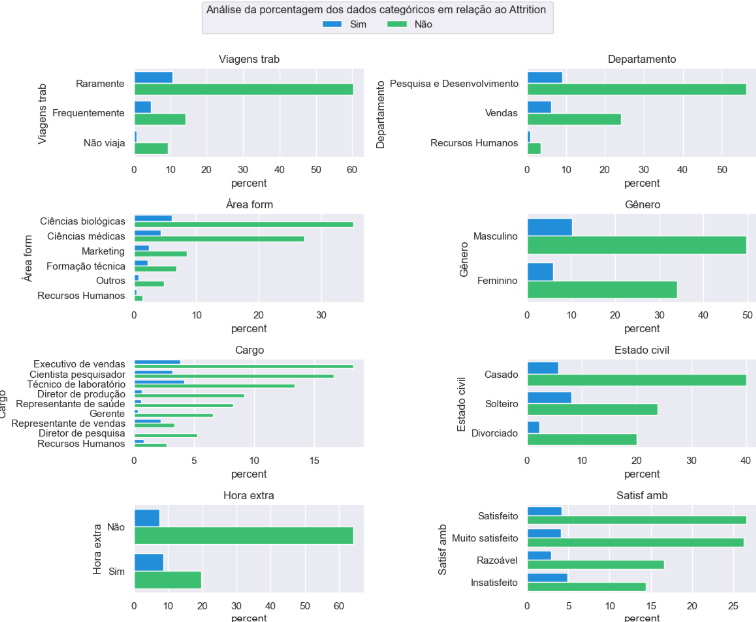
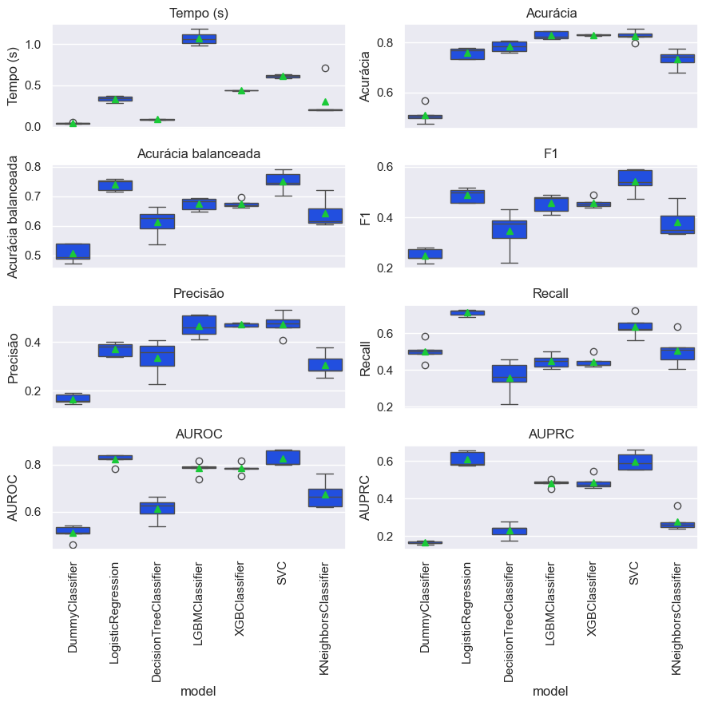
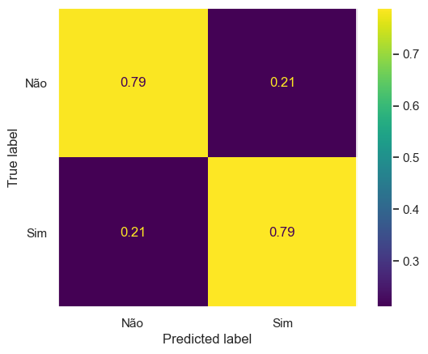
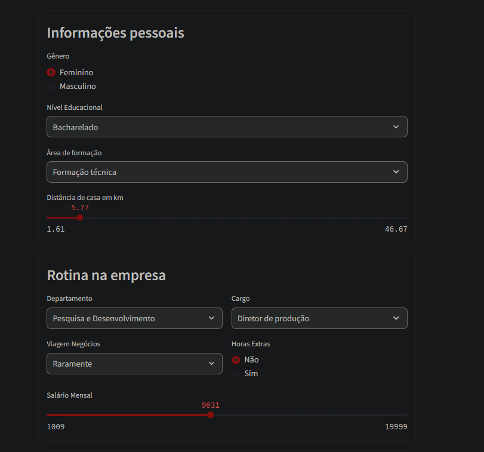

# 📌 Análise Preditiva de Attrition 



PT

## Visão Geral do Projeto

Este projeto tem como objetivo prever attrition de funcionários com base em características demográficas, profissionais e de satisfação no trabalho. Utilizei técnicas de Machine Learning para identificar os principais fatores que influenciam a saída de colaboradores.

## 🔍 Contexto

A base de dados contém:

1.470 registros e 31 variáveis.

Variáveis numéricas: idade, distância de casa, renda mensal, tempo de empresa, etc.

Variáveis categóricas: departamento, cargo, estado civil, viagens a trabalho, etc.

Target: Attrition (Sim/Não) → Dados desbalanceados (apenas 16% de casos "Sim").

## 📊 Principais Desafios

Desbalanceamento da classe target:

Testar técnicas como Random OverSampling (ROS) e SMOTE-Tomek, mas os resultados foram piores que o modelo sem balanceamento.

Solução: Usei class_weight='balanced' e scale_pos_weight em modelos baseados em árvores.

Pré-processamento diferenciado:

OneHotEncoder: Para variáveis categóricas não ordenadas.

OrdinalEncoder: Para variáveis ordinais (ex.: Satisfação no trabalho).

Escalonamento adaptado:

MinMaxScaler: Para tarifas (DailyRate, HourlyRate, MonthlyRate).

StandardScaler: Para Idade (distribuição próxima da normal).

PowerTransformer: Para outras variáveis numéricas.

## ⚙️ Modelos Testados


Modelo	Ajustes Especiais	Melhor Métrica (Avg Precision)
LogisticRegression	class_weight='balanced', GridSearch (C, penalty)	0.61
LGBMClassifier	scale_pos_weight=5.2	0.51
XGBClassifier	scale_pos_weight=5.2	0.46
SGDClassifier	-	0.58
SVC	-	0.63
DecisionTree	class_weight='balanced'	0.226

## 📉 Resultados



Melhor modelo: Regressão Logística com ElasticNet (C=0.1, l1_ratio=0.1).

Average Precision: 0.633

Recall alto (0.73): Identifica bem funcionários propensos a sair.

Precisão moderada (0.38): Reflexo do desbalanceamento.

## 🔎 Insights (Odds Ratio)

Fatores que AUMENTAM o risco de Attrition:

Hora extra = Sim (3.87x mais chance).

Formação Técnica (1.88x).

Estado civil solteiro (1.68x).

Fatores que DIMINUEM o risco:

Funcionários que não viajam têm 61% menos chance de deixar a empresa

Funcionários com a renda mensal alta tem  36% menos chance de deixar a empresa


## 📌 Conclusão

A Regressão Logística teve o melhor desempenho, equilibrando recall e precisão.

Técnicas de balanceamento (ROS, SMOTE-Tomek) não melhoraram os resultados.
    
    Algumas considerações a respeito:
    
        • Criticidade de outliers: Em problemas como attrition, casos raros (ex: um funcionário de alto desempenho que saiu) podem ser importantes, e SMOTE/ROS podem diluir seu impacto.
        • O modelo original (não balanceado) pode ter mantido melhor a capacidade de identificar padrões genuínos.

Variáveis como hora extra, viagens e estado civil são críticas para prever attrition.

A aplicação do modelo para a previsão de attrition foi feita através do Streamlit, tornando o processo mais simples e intuitivo. Além disso, o app permite a visualização da probabilidade de attrition para cada caso.

['Clique aqui para "Análise Preditiva de Attrition" '](https://predictive-attrition-analysis-fbps.streamlit.app/)



## 🚀 Próximos Passos


Plano de ação

Avaliar os motivos que levam os funcionários a fazerem hora extra.

    Mão de obra insuficiente

    Falta de organização institucional

    Falta de treinamento

    Necessidade de investimento em tecnologia

Possibilidade de diminuir as viagens de negócios.

    Como isso afeta a equipe de vendas?

Atenção aos funcionários de formação técnica

    Como a renda mensal se compara com o mercado? 

    Ações voltadas para o clima organizacional 

## Sobre a Base de Dados

Dataset: IBM HR Analytics Employee Attrition & Performance (Link no Kaggle).

Attrition vs. Turnover
Attrition: Saídas voluntárias (aposentadorias, demissões voluntárias).

Turnover: Todas as saídas (voluntárias + demissões).

## Organização do projeto

```

├── dados              <- Arquivos de dados para o projeto.
├── modelos            <- Modelos gerados para o projeto.
|
├── notebooks          <- Cadernos Jupyter. 
│
|   └──src             <- Código-fonte para uso neste projeto.
|      │
|      ├── __init__.py  <- Torna um módulo Python
|      ├── auxiliares.py<- Funções auxiliares do projeto
|      ├── config.py    <- Configurações básicas do projeto
|      ├── graficos.py  <- Scripts para criar visualizações exploratórias e orientadas a resultados
|      └── modelos.py   <- Funções utilizadas no modelo
|
├── referencias        <- Dicionários de dados.
├── relatorios         <- Relatório gerado durante o projeto utilizando a biblioteca [ydata-profiling]
│   └── imagens        <- Gráficos e figuras gerados para serem usados em relatórios
├── ambiente.yml       <- O arquivo de requisitos para reproduzir o ambiente de análise
├── requirements.txt   <- O arquivo para instalar dependências via pip
├── LICENSE            <- Licença de código aberto se uma for escolhida
├── README.md          <- README principal para desenvolvedores que usam este projeto.
|
```

## Configuração do ambiente

1. Faça o clone do repositório que será criado a partir deste modelo.

    ```bash
    git clone ENDERECO_DO_REPOSITORIO
    ```

2. Crie um ambiente virtual para o seu projeto utilizando o gerenciador de ambientes de sua preferência.

    a. Caso esteja utilizando o `conda`, exporte as dependências do ambiente para o arquivo `ambiente.yml`:

      ```bash
      conda env export > ambiente.yml
      ```

    b. Caso esteja utilizando outro gerenciador de ambientes, exporte as dependências
    para o arquivo `requirements.txt` ou outro formato de sua preferência. Adicione o
    arquivo ao controle de versão, removendo o arquivo `ambiente.yml`.


Para mais informações sobre como usar Git e GitHub, [clique aqui](https://cienciaprogramada.com.br/2021/09/guia-definitivo-git-github/). Sobre ambientes virtuais, [clique aqui](https://cienciaprogramada.com.br/2020/08/ambiente-virtual-projeto-python/).


EN

# 📌 Predictive Attrition Analysis

Project Overview
This project aims to predict employee attrition (turnover) in a company based on demographic, professional, and job satisfaction features. Using Machine Learning techniques, we explored different models to identify key factors influencing employee departures.

## 🔍 Context

The dataset contains 1,470 records with 31 variables, including:

Numerical variables: Age, Distance from Home, Monthly Income, Years at Company, etc.

Categorical variables: Department, Job Role, Marital Status, Business Travel, etc.

Target: Attrition (Yes/No) → Imbalanced data (16% "Yes").

## 📊 Key Challenges

Class imbalance:

Tested techniques like Random OverSampling (ROS) and SMOTE-Tomek, but results were worse than the unbalanced model.

Used class_weight='balanced' and scale_pos_weight for tree-based models.

Preprocessing:

OneHotEncoder: Non-ordinal categorical variables.

OrdinalEncoder: Ordinal variables (e.g., Job Satisfaction).

Scaling:

MinMaxScaler: Rates (DailyRate, HourlyRate, MonthlyRate).

StandardScaler: Age (near-normal distribution).

PowerTransformer: Other numerical variables (improved normalization).

## ⚙️ Tested Models

Model	Special Adjustments	Best Metric (Avg Precision)
LogisticRegression	class_weight='balanced', GridSearch (C, penalty)	0.633
LGBMClassifier	scale_pos_weight=5.2	0.504
XGBClassifier	scale_pos_weight=5.2	0.466
SGDClassifier	-	0.591
SVC	-	0.630
DecisionTree	class_weight='balanced'	0.226

## 📉 Results

Best model: Logistic Regression with ElasticNet (C=0.1, l1_ratio=0.1).

Average Precision: 0.633

High Recall (0.73): Effective at identifying employees likely to leave.

Moderate Precision (0.38): Reflects class imbalance challenges.

## 🔎 Key Insights (Odds Ratio)

Factors that INCREASE Attrition Risk:

Overtime = Yes (3.87x higher risk).

Frequent Business Travel (2.39x).

Single Marital Status (1.66x).

Factors that DECREASE Attrition Risk:

Job Satisfaction (0.73x).

High Monthly Income (0.64x).

Age (0.90x).

## 📌 Conclusion

Logistic Regression performed best, balancing recall and precision despite imbalanced data.

Oversampling techniques (ROS, SMOTE-Tomek) did not improve results, likely due to loss of critical information.

Variables like overtime, business travel, and marital status are critical predictors, while job satisfaction and income aid retention.

## 🚀 Next Steps

Action Plan
Overtime Analysis:

Investigate root causes (e.g., understaffing, poor organization, lack of training, tech gaps).

Reduce Business Travel:

Assess impact on sales teams.

Salary Benchmarking:

Compare departmental salaries to market rates.

Workplace Climate Initiatives:

Improve employee engagement and satisfaction.

About the Dataset
The dataset used is IBM HR Analytics Employee Attrition & Performance (Kaggle Link). It contains anonymized data from a fictional company, including demographics, job roles, satisfaction levels, and attrition status.

Attrition vs. Turnover
Attrition: Voluntary departures (retirements, resignations) leading to workforce reduction.

Turnover: All departures (voluntary + involuntary), often replaced.

## Technical Setup

Dependencies
Library	Version
Python	3.12.3
Matplotlib	3.9.2
Pandas	2.2.3
Scikit-Learn	1.5.1
Seaborn	0.13.2
Project Structure
├── data/               # Raw/processed data  
├── models/             # Trained models  
├── notebooks/          # Jupyter notebooks  
├── src/                # Source code  
│   ├── __init__.py  
│   ├── helpers.py      # Utility functions  
│   ├── config.py       # Project settings  
│   ├── plots.py        # Visualization scripts  
│   └── models.py       # Model training  
├── reports/            # Analysis outputs  
│   └── images/         # Graphs/figures  
├── environment.yml     # Conda environment  
└── requirements.txt    # Pip dependencies  
Setup Instructions
Clone the repository:

bash
git clone REPO_URL  
Create a virtual environment:

Conda:

bash
conda env create -f environment.yml  
Pip:

bash
pip install -r requirements.txt  

